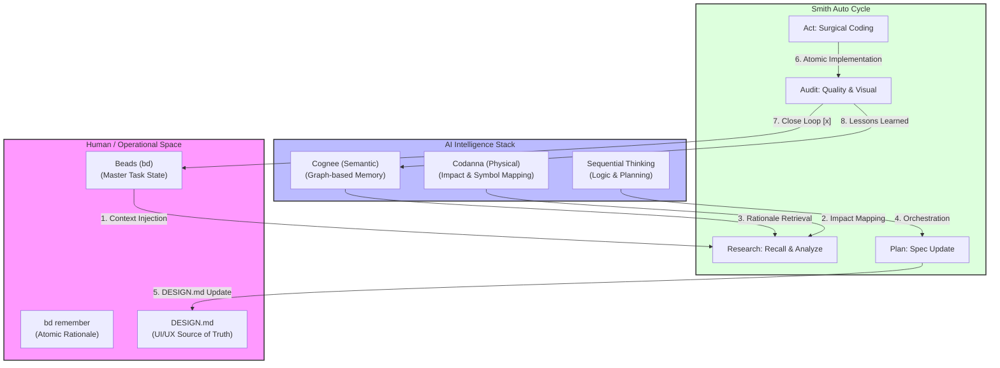

# Morphic AVAS Architecture: Intelligence Sync
Assume Role: @diagram-agent

This diagram maps the relationship between the human-facing **Beads (bd)** state and the AI-facing **Intelligence Stack**, ensuring the "Parity Law" is strictly enforced via the AVAS standard.

## AVAS (Agentic Visual Architecture Standard) Protocol
To ensure architectural clarity, all system diagrams MUST follow these rules:
1. **Mandatory Subgraphs**: Group logical layers (Operational, Domain, Infrastructure, AI).
2. **Labeled Connections**: Every arrow MUST describe the action or data flow (e.g., "Recall", "Inject", "Audit").
3. **Double-Line Sync**: Use distinct arrow styles for synchronous vs asynchronous data flows.
4. **Color Coding**: 
   - **Pink/Purple**: Human/Operational state.
   - **Blue/Indigo**: AI Intelligence & Memory.
   - **Green**: Execution & Implementation.
