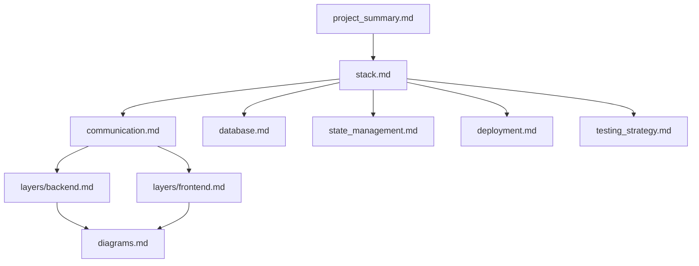

# 🏗️ Architecture Documentation

This folder is the **single source of truth for project-level architectural decisions** in the Morphic Framework. It contains both **framework-level specs** (constant across all projects) and **project-level init selectors** (filled at project start via the `/init` workflow).

---

## 📂 File Index

| File | Type | Purpose |
|------|------|---------|
| [`Technical_Specification.md`](./Technical_Specification.md) | Framework Spec | Executive summary of the Antigravity engine capabilities and requirements |
| [`triad.md`](./triad.md) | Framework Spec | AVAS-compliant Mermaid diagrams of the Antigravity → Gemini → Jules orchestration |
| [`communication.md`](./communication.md) | **Init Selector** | Communication protocol between frontend & backend — check one, fill registered methods |
| [`diagrams.md`](./diagrams.md) | **Init Selector** | Visual architecture diagram types — select which ones apply and populate them |
| [`stack.md`](./stack.md) | **Init Selector** | Tech stack choices per layer — check your selections at project start |
| [`project_summary.md`](./project_summary.md) | **Init Selector** | One-pager project identity, goals, and constraints |
| [`state_management.md`](./state_management.md) | **Init Selector** | State management strategy selector (Zustand, Redux, Riverpod, Bloc, etc.) |
| [`database.md`](./database.md) | **Init Selector** | Database & persistence layer selector |
| [`deployment.md`](./deployment.md) | **Init Selector** | Packaging & deployment target selector (Tauri, Docker, Cloud, etc.) |
| [`testing_strategy.md`](./testing_strategy.md) | **Init Selector** | Testing strategy selector (unit, integration, E2E, patrol, etc.) |
| [`layers/`](./layers/) | **Init Selectors** | Per-layer specs: `backend.md` (API methods, DB schemas) + `frontend.md` (components, routing) |

---

## 🗺️ How These Files Relate



---

## ✅ Init Selector Pattern

**Init selector files** follow a consistent structure:

1. **Protocol / Strategy Selection** — checkboxes (`- [ ]` / `- [x]`), top option is the default recommendation
2. **AI Prompt comment** — tells the AI what to do if no box is checked
3. **Option Specifications** — collapsible details per option, activated by the checkbox

```markdown
<!-- AI_PROMPT: If no option is checked, propose the top 3 that fit [project type]. 
     Once the user confirms, check the box and populate the sections below. -->

### Options
- [ ] **Option A** *(Recommended for X)*
- [ ] **Option B**
- [ ] **Option C**
```

> **AI Rule**: During the `/init` workflow, read every selector file in this folder. For any unchecked file, ask the user the minimal set of questions needed to make a selection, then populate the spec. Never start implementation before all selectors are resolved.

---

## 🔗 Cross-References

| Selector File | Corresponding Rule | Corresponding Skill |
|---|---|---|
| `stack.md` | `Architecture.md` | `code-quality`, `fullstack-developer` |
| `communication.md` | `Architecture.md` (Bridge Protocol) | `adk-expert`, `react` |
| `state_management.md` | `Architecture.md` (UI Structure) | `react`, `shadcn` |
| `database.md` | `Architecture.md` (Persistence) | `code-quality` |
| `deployment.md` | `CICD/` rules | `chrome-devtools` |
| `testing_strategy.md` | `Testing/` rules | `audit`, `code-gap-reviewer` |
