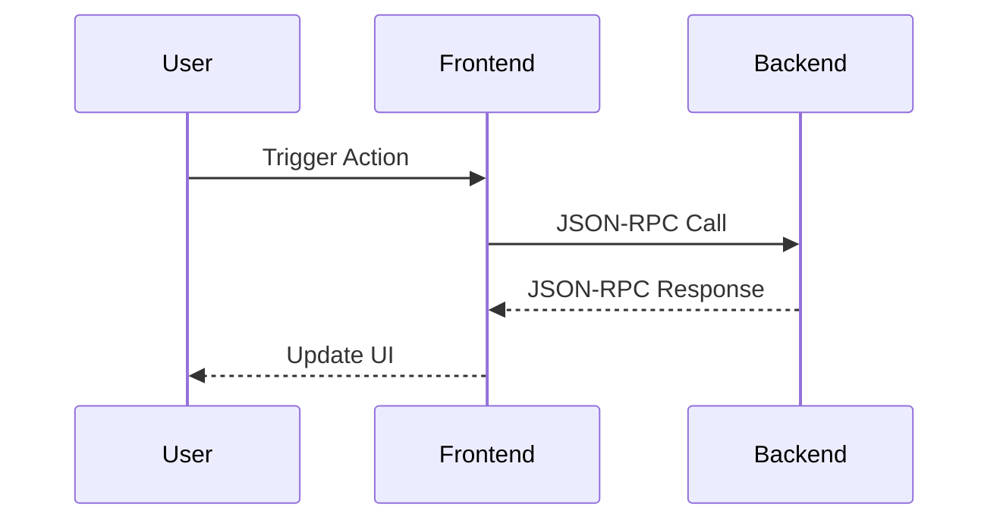
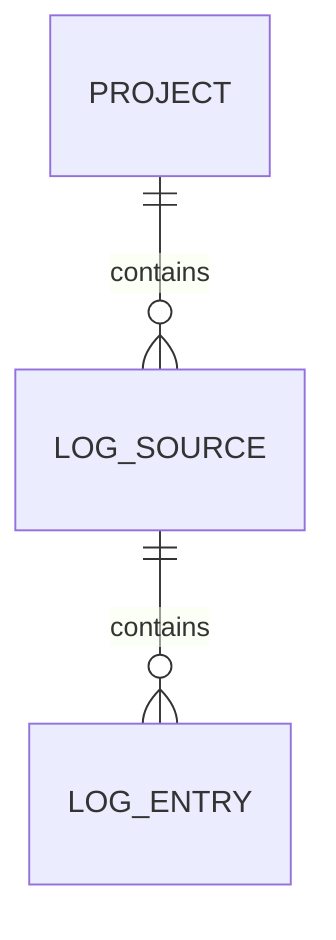

# 📊 Visual Architecture Diagrams

## Sequence Diagrams

```mermaid
sequenceDiagram
    participant User
    participant FE as Frontend
    participant BE as Backend
    User->>FE: Trigger Action
    FE->>BE: JSON-RPC Call
    BE-->>FE: JSON-RPC Response
    FE-->>User: Update UI
```

## Entity Relationship Diagram (ERD)

```mermaid
erDiagram
    PROJECT ||--o{ LOG_SOURCE : contains
    LOG_SOURCE ||--o{ LOG_ENTRY : contains
```
