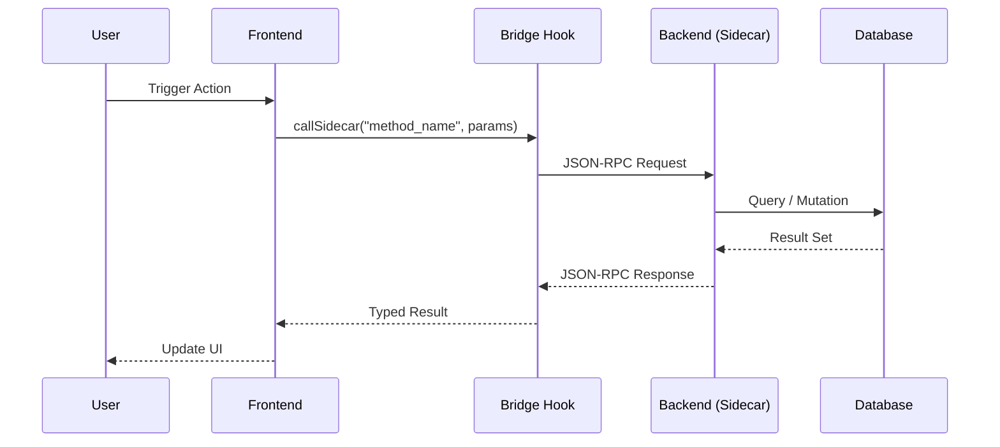
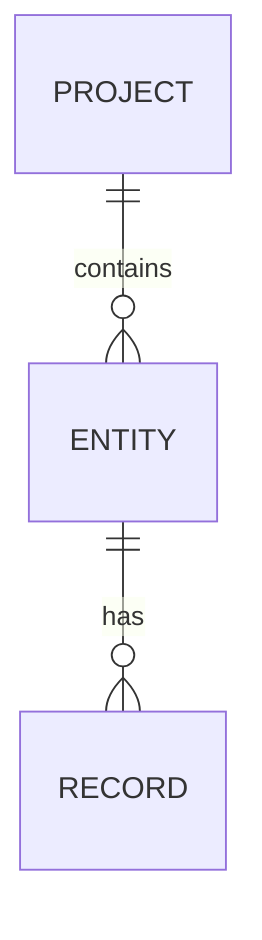
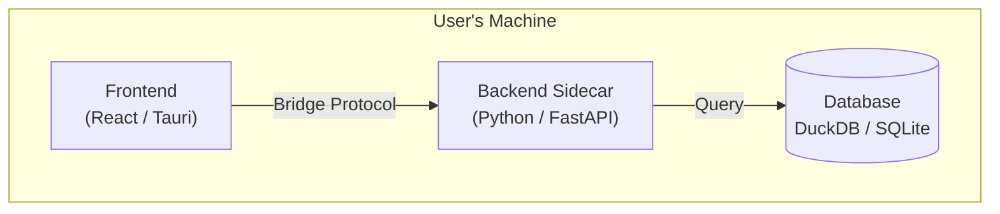
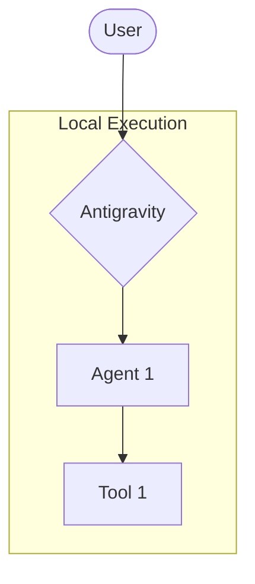
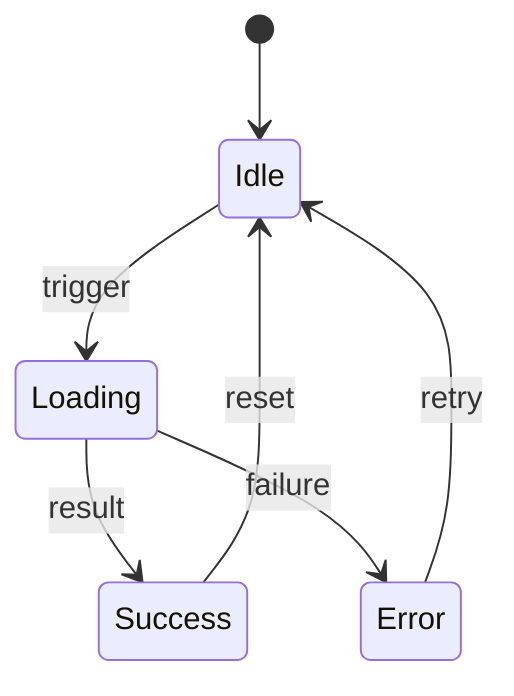

# 📊 Visual Architecture Diagrams

> **Init Selector** — Check the diagram types relevant to this project. The AI will generate and maintain the checked diagrams throughout the project lifecycle.

<!-- AI_PROMPT: If no diagram types are checked below, review `stack.md` and `communication.md`
     to determine which diagrams best capture this project's architecture. Propose the top 3.
     Once confirmed, generate an initial draft for each selected type using the diagram-creator skill. -->

---

## 🎨 Diagram Type Selection

- [ ] **System Context Diagram (C4 Level 1)** — How this system fits in the broader environment
- [ ] **Container Diagram (C4 Level 2)** — High-level tech containers (Frontend, Backend, DB, etc.)
- [x] **Sequence Diagram** — Frontend → Backend → DB request/response flow *(default: always)*
- [ ] **Component Diagram (C4 Level 3)** — Internal structure of a container
- [x] **ERD (Entity Relationship Diagram)** — Database schema relationships *(default: when DB exists)*
- [ ] **State Machine Diagram** — State transitions for complex UI flows or agentic loops
- [ ] **Data Flow Diagram (DFD)** — How data moves through the full system
- [ ] **Deployment Diagram** — Infrastructure topology (Docker, Cloud, Tauri packaging)
- [ ] **AI Agent Orchestration Diagram** — Agent→Tool→Agent delegation map (AVAS standard)
- [ ] **Atomic Design Component Map** — Atoms → Molecules → Organisms hierarchy

---

## 📐 Diagram Specifications

### 🔄 Sequence Diagram *(checked by default)*

> Update this diagram whenever a new API method is added to `communication.md`.

---

### 🗄️ Entity Relationship Diagram *(checked by default)*

> Update this diagram when `layers/backend.md` database schema changes.

---

### 🏗️ Container Diagram (C4 L2) *(fill when checked)*

---

### 🤖 AI Agent Orchestration Diagram *(fill when checked)*

> Follow AVAS standard: use subgraphs and labeled connections. Activate `diagram-creator` skill.

---

### 🎯 State Machine Diagram *(fill when checked)*

---

## 🔗 References

- **AVAS Law**: `.agents/rules/Specialized/VisualArchitecture.md`
- **Diagram Skill**: `.agents/skills/diagram-creator/`
- **Communication Flow**: `docs/architecture/communication.md`
- **DB Schema**: `docs/architecture/layers/backend.md`
