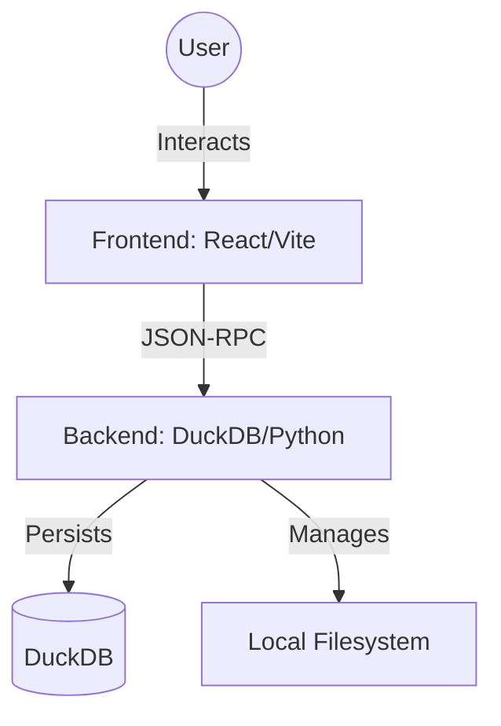

# 🏙️ System Architecture: Gemini Entry Point

## 🕴️ Personas (The Soul of the System)

The system is governed by the **Autonomous Development Team** as defined in `.agents/agents.md`.

## 🏗️ High-Level System Context (C4 Diagram)

## 🗺️ Navigation Map
- **Frontend Layer**: See [layers/frontend.md](file:///docs/architecture/layers/frontend.md)
- **Backend Layer**: See [layers/backend.md](file:///docs/architecture/layers/backend.md)
- **Communication Protocol**: See [communication.md](file:///docs/architecture/communication.md)
- **Visual Diagrams**: See [diagrams.md](file:///docs/architecture/diagrams.md)
