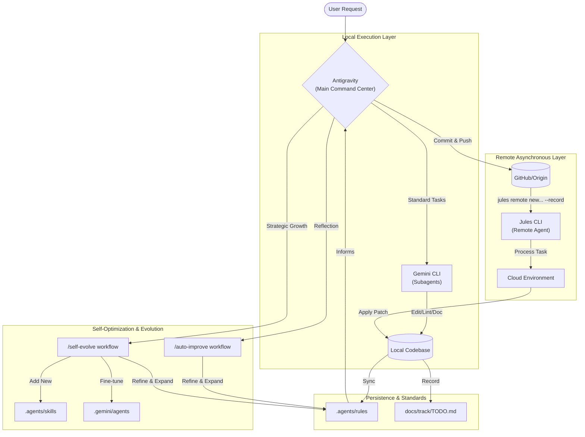
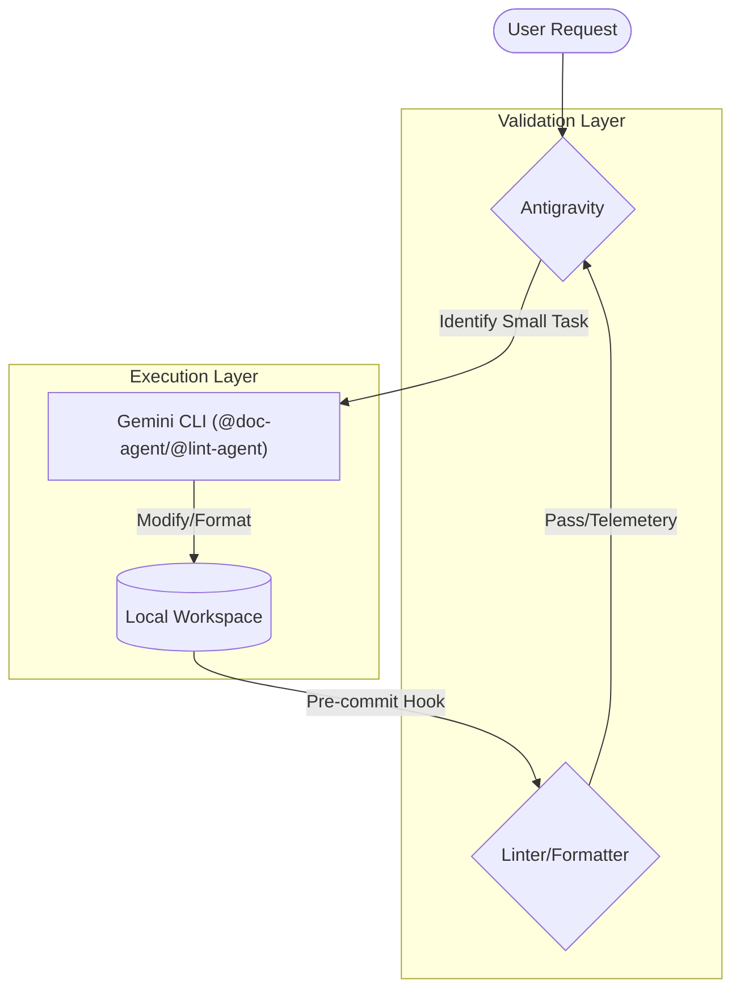
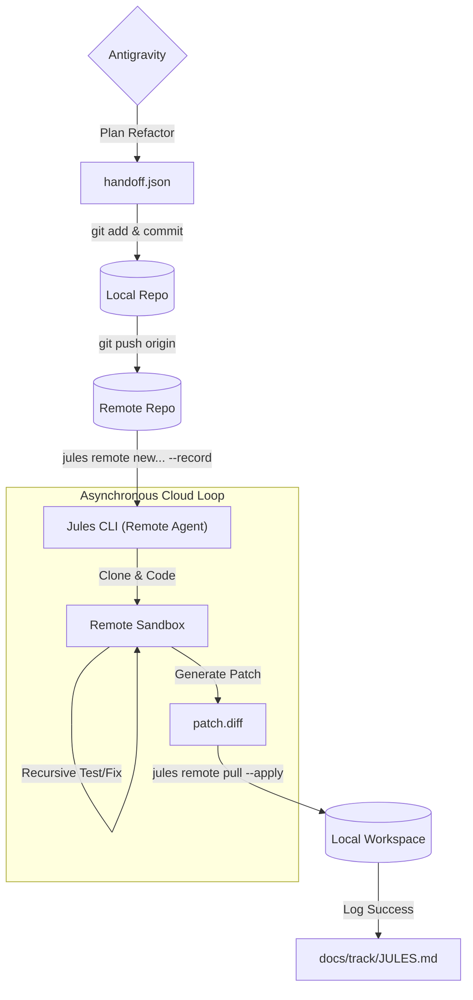
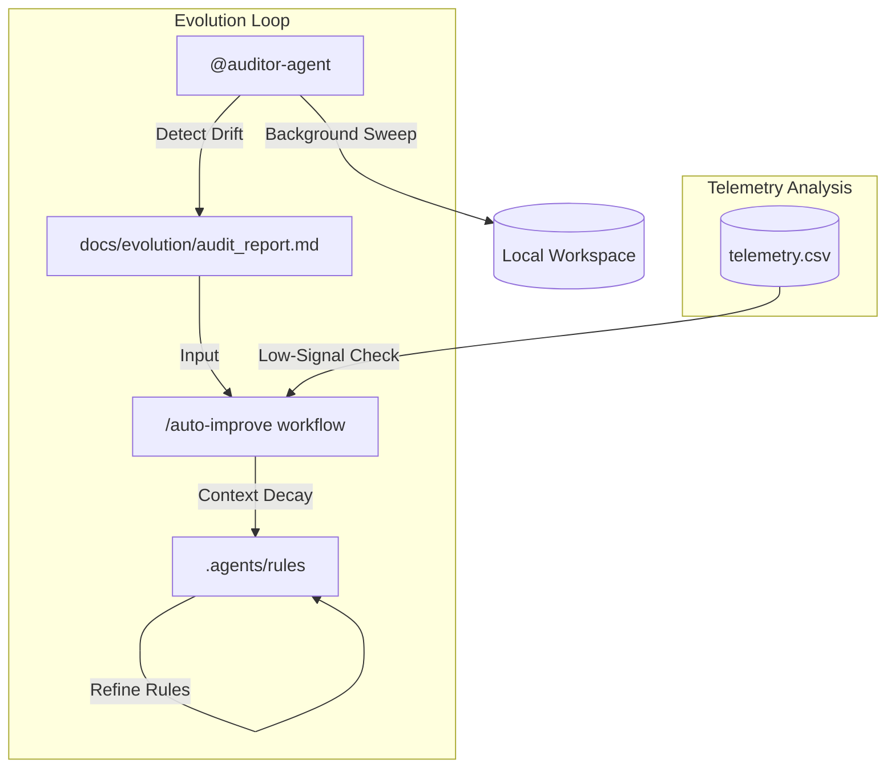
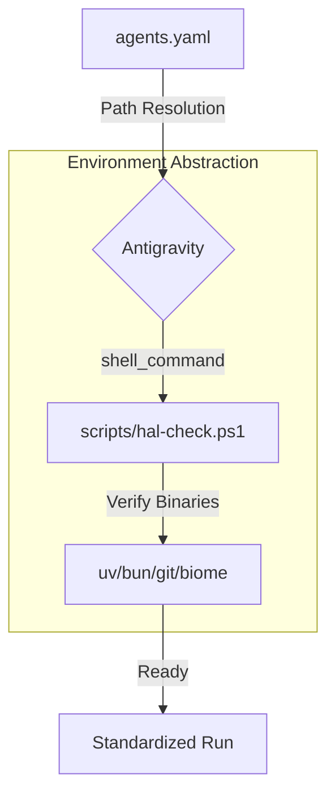

# AI Agentic Workflow Visualization

This diagram illustrates the interaction between the **Antigravity Command Center**, the **Gemini Subagents**, and the **Jules Remote Agent**.

## Workflow Use Cases

This section contains detailed diagrams illustrating how **Antigravity** resolves specific engineering challenges.

### 1. The Surgical Strike (High-Speed Local Edit)
Used for atomic code changes, linting, and documentation where immediate feedback is required.

---

### 2. The Deep Refactor (Manifest-based Remote Handoff)
Used for multi-file refactors and long-running feature builds that require asynchronous autonomy.

---

### 3. The Autonomous Evolution & Audit (Proactive Growth)
How the framework improves its own rules and detects architectural drift.

---

### 4. The Interoperability HAL (Universal Portability)
Standardizing environment setup across different developer machines and shells.

